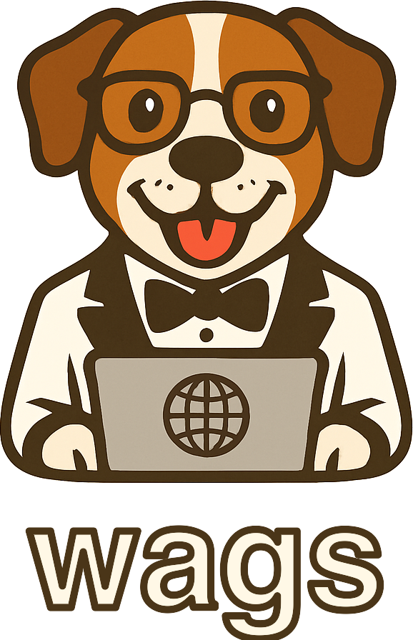

<div align="center">
  
</div>

# Welcome to wags

The <b style="font-family: Helvetica, Arial, sans-serif; font-weight: bold; letter-spacing: -0.02em;">wags</b> toolkit is based on state-of-the-art research into how multi-turn agents usually fail, and makes it straightforward to implement advanced countermeasures. While the Model Context Protocol (MCP) offers a standardized way for AI models to interact with external tools and data sources, we still don't fully understand what makes a good MCP server. <b style="font-family: Helvetica, Arial, sans-serif; font-weight: bold; letter-spacing: -0.02em;">wags</b> makes it easy to deploy the latest research on context engineering and several new MCP features improve user and agent experience without rewriting your existing MCP servers.

> ⚠️ **Warning**: <b style="font-family: Helvetica, Arial, sans-serif; font-weight: bold; letter-spacing: -0.02em;">wags</b> is based on ongoing research and is under active development. Features and APIs may change.

## Prerequisites

- Python 3.13.5 or higher
- [`uv` package manager](https://docs.astral.sh/uv/getting-started/installation/) (recommended) or `pip`
- Basic understanding of [MCP (Model Context Protocol)](https://modelcontextprotocol.io/introduction)
- An existing MCP server to work with

## Installation

```bash
# Clone the repository
git clone https://github.com/chughtapan/wags.git
cd wags

# Create and activate virtual environment
uv venv
source .venv/bin/activate

# Install the package in development mode
uv pip install -e ".[dev]"
```

### Verify Installation

```bash
wags version
```

You should see:
```
WAGS version 0.1.0
FastMCP version x.x.x
```

## Quick Start

`wags` provides the `quickstart` command to generate proxy servers that wrap existing MCP servers with middleware.

### Step 1: Prepare Your MCP Server Configuration

Create a configuration file that describes your MCP server. Save it as `config.json`:

```json
{
  "mcpServers": {
    "github": {
      "command": "npx",
      "args": ["-y", "@modelcontextprotocol/server-github"],
      "env": {
        "GITHUB_TOKEN": "${GITHUB_TOKEN}"
      }
    }
  }
}
```

### Step 2: Generate the Proxy Server

Use the `quickstart` command to generate middleware handlers and main file:

```bash
# Generate both handlers and main files
wags quickstart config.json

# Or with custom file names
wags quickstart config.json \
  --handlers-file github_handlers.py \
  --main-file github_proxy.py
```

### Step 3: Add Middleware Decorators

Edit the generated handlers file to add middleware decorators for access control and parameter review.

### Step 4: Run Your Proxy Server

```bash
python main.py 
```

Your proxy server is now running!

## CLI Commands

- `wags init <name>` - Initialize a new server with middleware scaffold
- `wags quickstart <config>` - Generate WAGS proxy server with middleware handlers
- `wags run <server_path>` - Run an MCP server with middleware
- `wags version` - Show version information

## Project Structure

```
src/
├── wags/                       # WAGS middleware framework
│   ├── cli/                   # CLI commands using cyclopts
│   │   └── main.py           # wags CLI entry point
│   ├── middleware/            # Middleware implementations
│   │   ├── base.py           # Base middleware abstract class
│   │   ├── elicitation.py    # Parameter elicitation middleware
│   │   └── roots.py          # Access control middleware
│   ├── utils/                 # Utility modules
│   │   ├── config.py         # Configuration management
│   │   ├── quickstart.py     # Quickstart command implementation
│   │   ├── server.py         # Server discovery and running
│   │   └── server_template.py    # Scaffold generation
│   └── proxy.py              # Proxy server for middleware chain
│
└── evals/                      # Evaluation framework
    ├── core/                   # Generic evaluation framework
    └── benchmarks/            # Benchmark implementations
```

## Middleware

For detailed middleware documentation, see the [full documentation](https://wags.dev).

## Documentation

### View Documentation Online
Visit [https://wags.dev](https://wags.dev) for the full documentation.

### Build Documentation Locally
```bash
# Build documentation
mkdocs build

# Serve documentation locally
mkdocs serve
```

## Development

### Testing
```bash
# Run all unit tests (excludes benchmarks by default)
.venv/bin/pytest tests/

# Run unit tests with coverage
.venv/bin/pytest tests/unit/ -v

# Run integration tests
.venv/bin/pytest tests/integration/ -v
```

### Code Quality
```bash
# Run linter
.venv/bin/ruff check src/ tests/

# Fix linting issues
.venv/bin/ruff check src/ tests/ --fix

# Format code with black
.venv/bin/black src/ tests/

# Run type checking
.venv/bin/mypy src/ --ignore-missing-imports
```

## License

Apache 2.0
