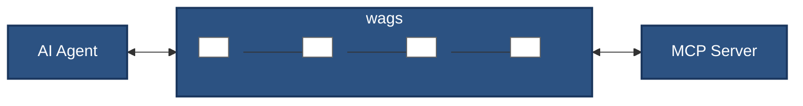

# Architecture Overview

The proxy-based architecture of <em class="wags-brand">wags</em> enables a fundamentally different approach to MCP server deployment. Organizations can start with any MCP server and incrementally add capabilities as they discover what they need. A team might begin by adding simple logging middleware to understand how agents use their tools, then later add access controls when they identify security concerns, and eventually implement custom middleware for domain-specific requirements. This iterative approach means you don't need to anticipate every requirement upfront or commit to a complex solution before understanding your actual needs.

The architecture also enables knowledge sharing across the MCP ecosystem. When one organization develops middleware to handle a specific failure mode, that solution becomes available to everyone. A financial services company's transaction confirmation middleware can be adapted by a healthcare provider for medication approvals. This compositional approach means the community collectively builds better solutions rather than each team solving the same problems in isolation.

## How It Works

The communication flow through <em class="wags-brand">wags</em> is bidirectional and transparent. When an AI agent makes a request, it travels through the middleware chain where each component can inspect, modify, or augment it based on configured rules. The processed request then reaches the MCP server, which responds normally without any awareness of the proxy layer. The response flows back through the middleware for any necessary enhancements before returning to the agent.

This design preserves the simplicity that makes MCP servers attractive while solving real production challenges. Server developers can focus on their core domain expertise without implementing authentication, rate limiting, or audit logging. Users can deploy servers quickly and add operational capabilities through middleware configuration rather than code changes. The same GitHub MCP server can be highly permissive for a research team but tightly controlled for a production deployment, all through middleware configuration rather than maintaining different server versions.

## Next Steps

- [Middleware Overview](middleware/overview.md) - Deep dive into middleware
- [Quick Start](quickstart.md) - Get started with <em class="wags-brand">wags</em>